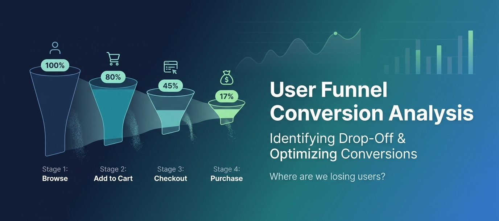
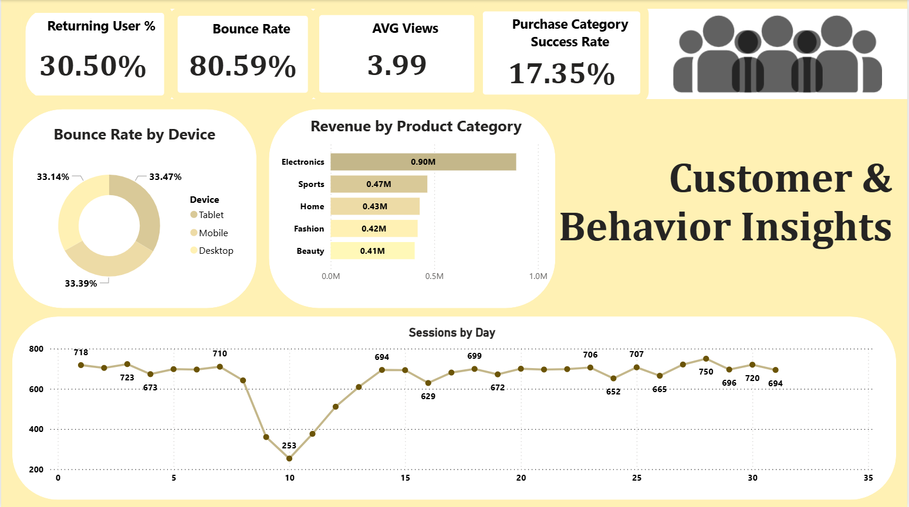
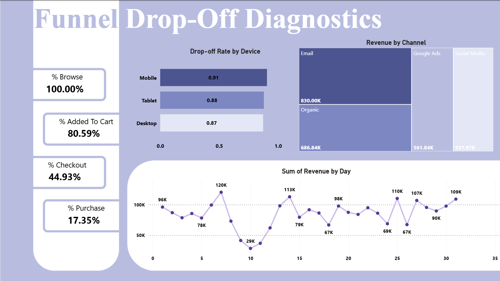
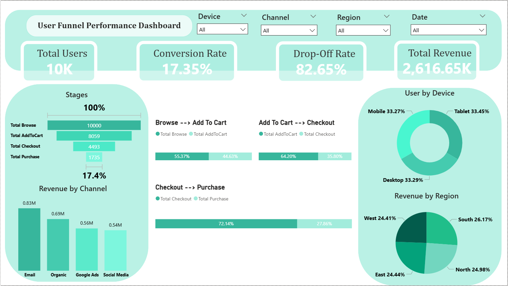

<p align="center">
  
</p>

# 📊 User Funnel Conversion & Drop-Off Analysis

## 🚀 Overview

This project analyzes user behavior across an e-commerce funnel to identify **conversion bottlenecks, user drop-off patterns, and revenue inefficiencies**.

The goal is not just to visualize metrics, but to **diagnose where and why users fail to convert** and provide actionable recommendations to improve business performance.

---

## 🎯 Problem Statement

E-commerce platforms often face:

* High traffic but low conversion rates
* Significant user drop-off across funnel stages
* Poor visibility into device and channel performance

This project answers a critical business question:

> **Where are we losing users in the funnel, and how can we improve conversion?**

---

## 🧠 Key Highlights

* **Conversion Rate:** 17.35%
* **Drop-Off Rate:** 82.65%
* **Bounce Rate:** 80.59%
* **Total Users Analyzed:** 10,000+

👉 Indicates major inefficiencies in the user journey despite stable traffic.

---

## 🔍 Funnel Breakdown

| Stage       | Users  | Conversion |
| ----------- | ------ | ---------- |
| Browse      | 10,000 | 100%       |
| Add to Cart | 8,059  | 80.59%     |
| Checkout    | 4,493  | 44.93%     |
| Purchase    | 1,735  | 17.35%     |

### 🚨 Insight:

The biggest drop-offs occur at:

* **Browse → Add to Cart**
* **Checkout → Purchase**

---

## 📊 Dashboards

### 1. Customer Behavior Insights



---

### 2. Funnel Drop-Off Diagnostics



---

### 3. User Funnel Performance Dashboard



---

## 📈 Key Insights

### 🚨 1. High Funnel Drop-Off

* Over **80% of users do not complete the purchase journey**
* Indicates strong intent but weak execution in later stages

---

### 📱 2. Mobile Performance Issue

* Mobile has the **highest drop-off (~91%)**
* Suggests UX or performance problems on mobile devices

---

### 📉 3. High Bounce Rate

* **80.59% bounce rate**
* Majority of users leave without engagement

---

### 💰 4. Channel Effectiveness

* **Email & Organic** drive most revenue
* Paid channels underperform

---

### 📦 5. Category Revenue Concentration

* Electronics dominates revenue
* Other categories show lower engagement

---

## 🛠️ Tech Stack

* **Python (Pandas, NumPy)** → Data processing & analysis
* **Jupyter Notebook** → EDA & funnel modeling
* **Power BI** → Interactive dashboards & visualization

---

## 📂 Project Structure

```bash
user-funnel-conversion-dropoff-analysis/
│
├── data/                  # Dataset used for analysis
├── notebooks/             # Data generation & analysis notebooks
├── dashboards/            # Power BI file + dashboard screenshots
├── reports/               # Key business insights
└── README.md
```

---

## ⚙️ Data Workflow

1. Generated realistic funnel dataset using Python
2. Performed data cleaning & transformation
3. Mapped user journey stages:

   * Browse → Add to Cart → Checkout → Purchase
4. Calculated:

   * Conversion rates
   * Drop-off rates
   * Revenue distribution
5. Built interactive dashboards in Power BI

---

## 💡 Business Recommendations

* Optimize **mobile user experience**
* Reduce friction in **checkout process**
* Improve **landing page engagement** to lower bounce rate
* Reallocate budget to **high-performing channels**
* Strengthen underperforming product categories

---

## 🧩 What This Project Demonstrates

* Funnel & conversion analysis
* Product thinking & business insights
* Data storytelling using dashboards
* End-to-end analytics workflow

---

## 🚀 Future Improvements

* Cohort-based retention analysis
* Funnel segmentation (new vs returning users)
* A/B testing for conversion optimization
* Predictive modeling for user conversion

---

## 👤 Author

**Vivek Balmiki**
Aspiring Data Scientist | Product Analytics Enthusiast

---
